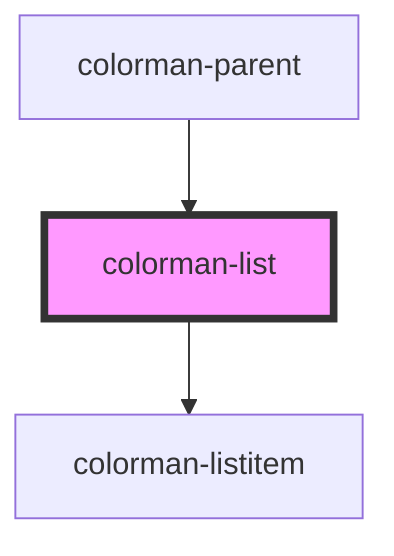

# colorman-list

<!-- Auto Generated Below -->

## Properties

| Property    | Attribute | Description | Type      | Default |
| ----------- | --------- | ----------- | --------- | ------- |
| `itemsList` | --        |             | `Item[]`  | `[]`    |
| `loading`   | `loading` |             | `boolean` | `true`  |

## Dependencies

### Used by

 - [colorman-parent](../colorman-parent)

### Depends on

- [colorman-listitem](../colorman-listitem)

### Graph

----------------------------------------------

*Built with [StencilJS](https://stenciljs.com/)*
