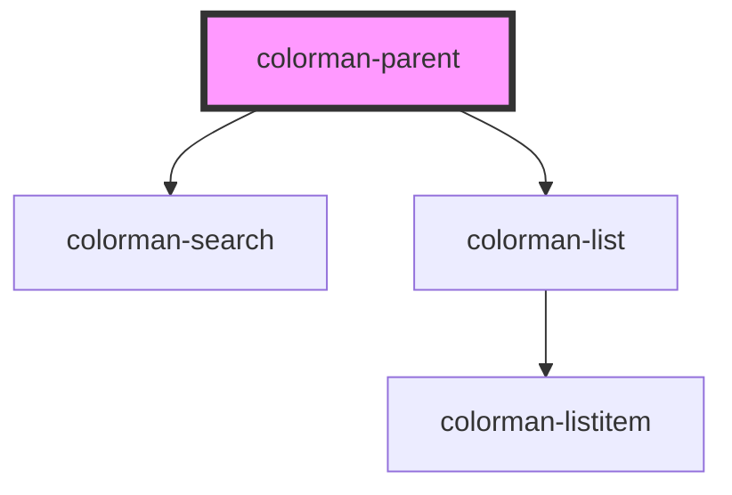

# my-component

<!-- Auto Generated Below -->

## Properties

| Property   | Attribute   | Description | Type     | Default     |
| ---------- | ----------- | ----------- | -------- | ----------- |
| `appId`    | `app-id`    | App ID      | `string` | `undefined` |
| `bundleId` | `bundle-id` | Bundle ID   | `string` | `undefined` |

## Dependencies

### Depends on

- [colorman-search](../colorman-search)
- [colorman-list](../colorman-list)

### Graph

----------------------------------------------

*Built with [StencilJS](https://stenciljs.com/)*
