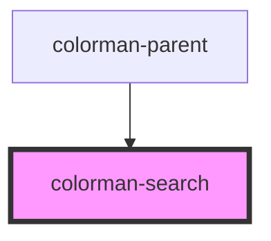

# colorman-search

<!-- Auto Generated Below -->

## Properties

| Property      | Attribute      | Description | Type     | Default |
| ------------- | -------------- | ----------- | -------- | ------- |
| `searchQuery` | `search-query` |             | `string` | `''`    |

## Events

| Event                 | Description | Type               |
| --------------------- | ----------- | ------------------ |
| `colormanQueryChange` |             | `CustomEvent<any>` |

## Dependencies

### Used by

 - [colorman-parent](../colorman-parent)

### Graph

----------------------------------------------

*Built with [StencilJS](https://stenciljs.com/)*
